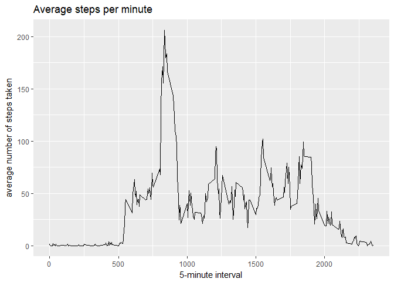

# Reproducible Research: Peer Assessment 1

## Loading and preprocessing the data

```r
library(dplyr)
```

```
## 
## Attaching package: 'dplyr'
```

```
## The following objects are masked from 'package:stats':
## 
##     filter, lag
```

```
## The following objects are masked from 'package:base':
## 
##     intersect, setdiff, setequal, union
```

```r
library(readr)
library(ggplot2)
data <- readr::read_csv("activity.csv")
```

```
## Parsed with column specification:
## cols(
##   steps = col_integer(),
##   date = col_date(format = ""),
##   interval = col_integer()
## )
```

## What is mean total number of steps taken per day?

```r
library(dplyr)
library(readr)
library(ggplot2)
total.steps.daily <- data %>% filter(!is.na(steps)) %>% group_by(date) %>% summarise(total = sum(steps))
qplot(total.steps.daily$total, data = total.steps.daily, binwidth=1000, xlab="Steps", ylab= "Days", main="Steps taken on a Daily basis", geom = "histogram")
```

<!-- -->

```r
total.steps.daily %>% summarise(mean(total))
```

```
## # A tibble: 1 x 1
##   `mean(total)`
##           <dbl>
## 1      10766.19
```

```r
total.steps.daily %>% summarise(median(total))
```

```
## # A tibble: 1 x 1
##   `median(total)`
##             <int>
## 1           10765
```

## What is the average daily activity pattern?

```r
library(dplyr)
library(readr)
library(ggplot2)
averages <- data %>% filter(!is.na(steps)) %>% group_by(interval) %>% summarise(steps = mean(steps))
ggplot(data = averages, aes(x = interval, y = steps)) +
		geom_line() +
		xlab("5-minute interval") +
		ylab("average number of steps taken") + 
		ggtitle("Average steps per minute")
```

<!-- -->

On average across all the days in the data set, the 5-minute interval contains
the maximum number of steps?

```r
averages[which.max(averages$steps),]
```

```
## # A tibble: 1 x 2
##   interval    steps
##      <int>    <dbl>
## 1      835 206.1698
```

## Imputing missing values

The first step is to find the number of missing values in the data set:


```r
sum(is.na(data$steps))
```

```
## [1] 2304
```

All of the missing values are filled in with the mean value of steps.


```r
library(dplyr)
library(readr)
library(ggplot2)
mean.all.steps <- data %>% filter(!is.na(steps)) %>% summarise(mean(steps))
# Create a new dataset that is equal to the original dataset but with the missing data filled in
filled.data <- data
filled.data$steps[is.na(filled.data$steps)] <- as.numeric(mean.all.steps)
```
Now, using the filled data set, let's make a histogram of the total number of steps taken each day and calculate the mean and median total number of steps.


```r
library(dplyr)
library(readr)
library(ggplot2)
total.steps.daily.new <- filled.data %>% group_by(date) %>% summarise(total = sum(steps))
qplot(total.steps.daily.new$total, data = total.steps.daily.new, binwidth=1000, xlab="Steps", ylab= "Days", main="Steps taken on a Daily basis", geom = "histogram")
```

<!-- -->

```r
total.steps.daily.new %>% summarise(mean(total))
```

```
## # A tibble: 1 x 1
##   `mean(total)`
##           <dbl>
## 1      10766.19
```

```r
total.steps.daily.new %>% summarise(median(total))
```

```
## # A tibble: 1 x 1
##   `median(total)`
##             <dbl>
## 1        10766.19
```

Filling in the missing values with the mean number of steps did not change the mean and median values per day. However, if you examine the histogram, you can see that the distribution is more "peaked".

## Are there differences in activity patterns between weekdays and weekends?

First, let's find the day of the week for each measurement in the data set. In
this part, we use the data set with the filled-in values.


```r
library(dplyr)
library(readr)
library(ggplot2)
filled.data <- filled.data %>% mutate(day = if_else(weekdays(date) %in% c("Saturday", "Sunday"), "weekend", "weekday"))
```

Now, let's make a panel plot containing plots of average number of steps taken
on weekdays and weekends.

```r
library(dplyr)
library(readr)
library(ggplot2)
averages.new <- filled.data %>% group_by(day, interval) %>% summarise(steps = mean(steps))
ggplot(averages.new, aes(interval, steps)) + 
		geom_line() + 
		facet_grid(day ~ .) +
		xlab("5-minute interval") + 
		ylab("Number of steps")
```

<!-- -->
